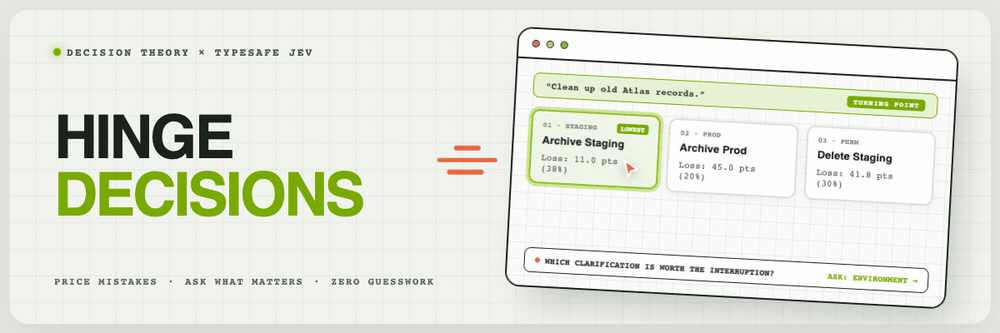
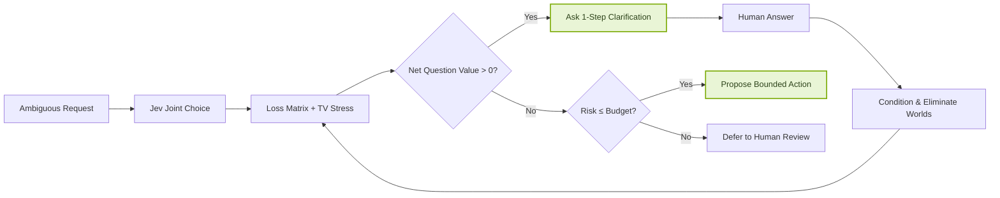
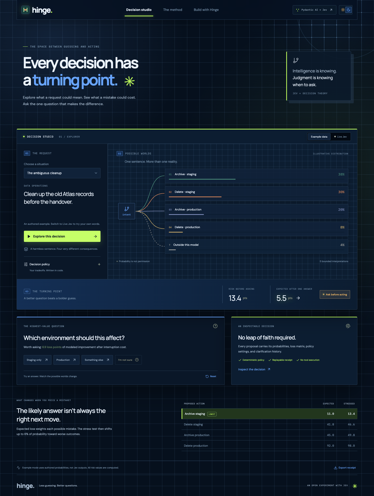
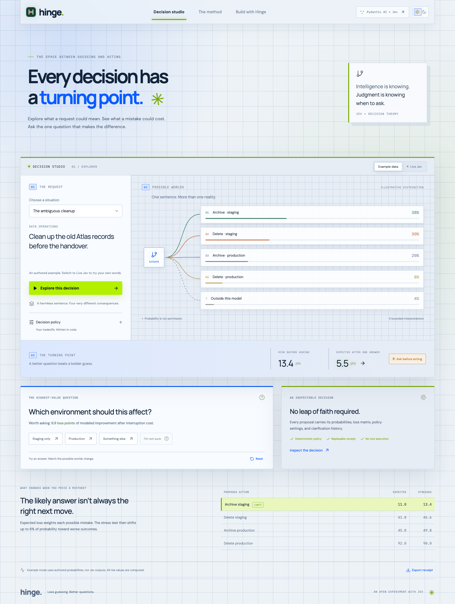

<div align="center">



# Hinge

### 🎯 Every decision has a turning point. Which clarification is worth the interruption?

[](https://nodejs.org)
[](https://www.typescriptlang.org)
[](https://typesafe.ai)
[](LICENSE)
[](#-verification-and-evaluation)

<p align="center">
  <a href="#-quickstart"><strong>Quickstart</strong></a> •
  <a href="#-why-hinge"><strong>Why Hinge</strong></a> •
  <a href="#-how-it-works"><strong>How It Works</strong></a> •
  <a href="#-interactive-decision-studio"><strong>Decision Studio</strong></a> •
  <a href="#-embed-the-engine"><strong>Embed Code</strong></a> •
  <a href="#-receipts--auditability"><strong>Receipts</strong></a>
</p>

</div>

---

## ⚡ Overview

> _“Clean up the old Atlas records.”_  
> Archive or delete? Staging or production?

Most automation demos stop at classification: pick the argmax label and execute. **Hinge** makes the downstream operational tradeoff inspectable.

It pairs **TypeSafe Jev** typed probability distributions with formal decision theory:

1. **Prices mistakes** via developer-authored loss matrices.
2. **Stress-tests probabilities** using exact Total Variation distance to catch miscalibration.
3. **Ranks clarifying questions** by Value of Information (VoI) minus interruption cost.
4. **Conditions distributions** dynamically as human answers eliminate worlds.
5. **Exports cryptographically signed receipts** with SHA-256 digests for replayable governance.



---

## 🖥️ Interactive Decision Studio

Hinge features a local visual workbench with smooth canvas-driven grid spotlighting, interactive branch trees, and real-time loss sensitivity sliders:

|               🌙 Dark Mode (Interactive Glow)                |                    ☀️ Light Mode                    |
| :----------------------------------------------------------: | :-------------------------------------------------: |
| [](docs/studio-dark.png) | [](docs/studio.png) |

> [!TIP]
> **Fluid Grid Dynamics:** Moving your cursor across the workbench casts an interactive spotlight that illuminates grid lines, lights up precision intersection crosshairs, and ripples across cells on click.

---

## 🚀 Quickstart

Requires Node.js 22+.

```bash
# 1. Clone & install
git clone https://github.com/satiricalguru/Hinge-Jev.git
cd Hinge-Jev
npm install

# 2. Start the local studio (runs immediately without any API key!)
npm run dev
```

Open **[http://127.0.0.1:5173](http://127.0.0.1:5173)** in your browser.

- **Example Mode**: Works out of the box with zero configuration. Distributions are authored fixtures; all loss evaluations, worst-case stress tests, Bayesian conditioning, and SHA-256 receipts are **100% computed in real-time**.
- **Live Jev Inference**: Add your [TypeSafe early-access credentials](https://console.typesafe.ai/keys) to `.env`:
  ```dotenv
  TYPESAFE_API_KEY=your_key_here
  TYPESAFE_MODEL=jev-1.13.0
  ```
  Switch to **Live Jev** in the top bar to evaluate custom sentences with live model inference.

---

## 🔬 How It Works

### The Decision Formulation

For action $a$, world $w$, and model distribution $p$:

```text
expected_loss(a) = Σ p(w) × loss(a, w)
stressed_loss(a) = max[q: TV(q, p) ≤ ε] Σ q(w) × loss(a, w)
question_value   = best_stressed_loss_now
                   − Σ P(answer) × best_stressed_loss_after_answer
                   − interruption_cost
```

$$
\mathcal{L}_{\mathrm{expected}}(a) = \sum_{w} p(w) \cdot \mathcal{L}(a, w)
$$

$$
\mathcal{L}_{\mathrm{stressed}}(a) = \max_{q:\, \mathrm{TV}(q, p) \le \varepsilon} \sum_{w} q(w) \cdot \mathcal{L}(a, w)
$$

$$
\mathcal{V}(\text{question}) = \min_{a} \mathcal{L}_{\mathrm{stressed}}(a) - \sum_{k} P(\text{answer}_k) \min_{a} \mathcal{L}_{\mathrm{stressed}}(a \mid \text{answer}_k) - \text{cost}
$$

### Key Guarantees

- **Adversarial Worst-Case Shift**: The TV optimizer shifts probability mass into high-loss worlds up to radius $\varepsilon$. It maintains support over worlds with $0\%$ model probability unless ruled out by a confirmed human answer.
- **Positive Net Value Rule**: Hinge interrupts the human with a question **only** when the expected reduction in operational risk strictly exceeds the interruption cost.
- **Bounded Fallbacks**: If the outside-model probability exceeds $20\%$, evidence contradicts modeled support, or remaining risk exceeds budget, Hinge safely defers to human review.

---

## 📦 Embed the Engine

The core decision engine is pure TypeScript with **zero runtime dependencies**:

```typescript
import { decide } from "./src/core/engine";
import { scenarios } from "./src/core/scenarios";

const decision = decide(
  scenarios[0],
  probabilitiesFromJev,
  {
    riskBudget: 3,
    ambiguity: 0.06,
    questionCost: 1.0,
  },
  [{ questionId: "environment", answerId: "staging" }],
);

// decision.kind: 'ask' | 'act' | 'defer'
if (decision.kind === "ask") {
  console.log("Interrupt with question:", decision.nextQuestion);
} else if (decision.kind === "act") {
  console.log(
    "Safe to propose:",
    decision.bestAction,
    "with risk",
    decision.risk,
  );
} else {
  console.log("Risk exceeds budget or out-of-domain. Defer to human review.");
}
```

---

## 📜 Receipts & Auditability

Every decision generates a deterministic **SHA-256 decision receipt**:

```json
{
  "schema": "hinge.receipt.v1",
  "createdAt": "2026-09-22T19:12:50.285Z",
  "scenario": "atlas",
  "request": "Clean up the old Atlas records before the handover.",
  "settings": { "riskBudget": 3, "ambiguity": 0.06, "questionCost": 1 },
  "confirmations": [{ "questionId": "environment", "answerId": "staging" }],
  "decision": {
    "kind": "act",
    "bestAction": "archive_staging",
    "risk": 11.0
  },
  "digest": "501ab1b21d819d988ad26c2da8d2c5f896aa3fc53e0685670f5f37b923fc7f01"
}
```

Verify or replay any receipt at any time:

```bash
npm run evaluate -- --replay path/to/receipt.json
```

---

## 🧪 Verification and Evaluation

| Command                            | Purpose                  | Verification Details                                                                                          |
| :--------------------------------- | :----------------------- | :------------------------------------------------------------------------------------------------------------ |
| `npm test`                         | **Unit Tests**           | 13/13 tests verifying TV optimizer against exhaustive grid search, Bayesian conditioning, and receipt hashes. |
| `npm run evaluate`                 | **Synthetic Evaluation** | Compares argmax loss vs VoI-clarified loss across Atlas, Release, and Sharing domains.                        |
| `npm run evaluate:live`            | **Live Inference**       | Evaluates 9 smoke cases against TypeSafe API; reports Brier score, latency, and tokens.                       |
| `python3 scripts/browser_smoke.py` | **E2E Smoke Tests**      | Playwright test covering desktop/mobile viewports, themes, sliders, modals, and receipt export.               |
| `npm run format:check`             | **Code Quality**         | Prettier enforcement across TypeScript, CSS, HTML, and Markdown.                                              |

---

## 📂 Repository Structure

```text
Hinge-Jev/
├── docs/                   # Visual documentation & generated previews
│   ├── banner.gif          # Animated project banner
│   ├── studio.png          # Light mode workbench capture
│   └── studio-dark.png     # Dark mode workbench capture
├── src/
│   ├── core/
│   │   ├── engine.ts       # Pure math & decision theory optimizer (TV, VoI)
│   │   ├── scenarios.ts    # Audited domains (Atlas, Rollback, Customer Share)
│   │   └── types.ts        # TypeScript schemas for scenarios & receipts
│   ├── App.tsx             # Interactive studio application
│   ├── InteractiveGrid.tsx # Canvas-based interactive mouse grid animation
│   └── styles.css          # Theme design tokens & responsive CSS
├── server/
│   ├── index.ts            # Fast local HTTP server & Vite integration
│   ├── provider.ts         # TypeSafe Jev API connector & schema parser
│   └── receipt.ts          # Deterministic SHA-256 receipt generator
└── tests/
    ├── engine.test.ts      # Math, policy invariants, and replay tests
    └── provider.test.ts    # Jev contract & network failure simulations
```

---

## 🛡️ License

MIT License. Independent research and implementation; not officially affiliated with TypeSafe AI.
